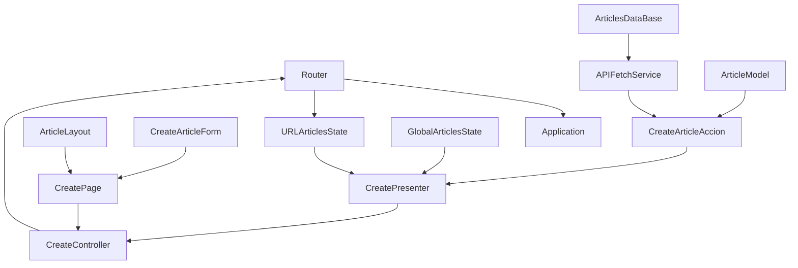

# Publicación y Debate de Ideas
**PyDI** es una herramienta para generar conocimiento colectivo. Nos ayuda a escribir un artículo con fuentes y a publicarlo, tanto para difundirlo, como para mejorarlo a través de devoluciones, fundamentadas y moderadas por el autor.

Las devoluciones son articulos, así que cada idea puede ser origen de infinitos conocimientos, cada conocimiento generado a través de la herramienta tiene un historial de ideas que la componen y uno puede revisar como se fue formando. Esto permite retomar caminos abandonados y llegar nuevas concluciones.

**PyDI** surge de la necesidad de mejorar el nivel de información disponible en internet, por lo que pone el foco en acelerar el chequeo de la veracidad de los datos y en mejorar el intercambio entre personas.

# Capacidades de la herramienta

## Actuales
* Administrador de articulos
  * Lista articulos
  * Crea articulos con:
    * contenido
    * fecha
    * resumen
    * título
    * fuentes
    * temas
## Futuros
* Crear
  * Vinculo entre articulos a través de fuentes
* Listar
  * por temas
  * por palabras más usadas
  * fuentes

# Organización del proyecto

La finalidad de este proyecto es plantear una arquitectura de front-end, por eso mismo, puede que vean código duplicado o capas que estén de más. Las técnicas que generan estos estados temporales en la base de código son:

1) Hacer visible la duplicación de comportamiento copiando y pegando implementaciones hasta que se cumplan los "tres strikes", es decir que se utilice el mismo código en tres lugares distintos. Recién en ese momento se realiza una abstracción.
2) Crear capas temporales para ver como se distribuyen las *responsabilidades* a partir de estas, escribiendo muchas veces clases anémicas de pocos métodos.

Por otra parte van a ver clases o dependencias de clases que son creadas para implementar técnicas como IDD o que facilitan el testeo y nos dan ventajas al usar TDD. Estas son clases que, de quedar muy chicas, se podrían pasar las *responsabilidades* que manejan a otras clases y borrarlas para disminuir la burocracia del código.

Por burocracia me refiero a estar obligado a crear determinados archivos, sólo por la arquitectura que llevamos. Al diseñar una arquitectura tenemos que pensar el trade-off de nuestras decisiones, el balance entre los pros y los contras de la mismas. Un primer paso es revisar el *contexto* de lo que estamos resolviendo y analizar cuanta solidez y escalabilidad necesitamos. Ambas caracteristicas suelen estar relacionadas a un aumento de la burocracia, por otro lado nos sirven para saber exactamente dónde agregar qué cosa en proyectos con bases de código muy grandes.

Si estamos desarrollando un MVP no queremos burocracia, necesitamos poner en producción las features definidas con a la mayor velocidad posible, lo cual no implica desorden. Para evitar el caos en una base de código en la cual la calidad, legilibilidad y arquitectura son secundarias, es importante tener en claro las capas de nuestra aplicación, es decir, como repartimos las *responsabilidades*. Así cuando decidimos *no perder tiempo* en mejorar crear una variable nueva, o mover archivos a carpetas nuevas o cambios que impactan en como se comunican las distintas partes del código, sabemos a consciencia qué deuda técnica estamos dejando.

Este repositorio apunta a eso, a pensar y reconocer las *responsabilidades* que tenemos en una aplicación web medianamente compleja a través de un ejemplo. Remarco que no apunto a establecer cómo se tienen que organizar el código en el desarrollo web, las soluciones que implementen a partir del conocimiento adquirido aquí pueden ser completamente distintas.

## Estructura de carpetas

Antes de adentrarnos en el cómo y el por qué de cada carpeta nos faltaría repasar cúales son las *responsabilidades* que vemos en una aplicación web, los cuales son los fundamentos para la división de carpetas realizada.

El nivel conceptual más "macro", el zoom más lejano, el continente conceptual del mapa que estamos analizando está dividido en tres:

* **Dominio**: lógica particular de nuestra aplicación, llamada también *de negocios*, por más que no sea de un comercio. Por ejemplo, en wikipedia sería la lógica referida a la creación de una articulo, en twitter la lógica referida a quien puede leer o no un tweet.
* **Aplicación**: lógica relacionada al tipo de aplicación a través de la cual vamos a entregar nuestras funcionalidades de dominio al usuario, está relacionado con el tipo de interfás, tales como APIs, lineas de comando, web, mobile, realidad aumentada, VR.
* **Infraestructura**: lógica relacionada a necesidades físicas de nuestra aplicación, tales como bases de datos, servidores web. No suelen ser vistas por el usuario, más que a través del dispositivo que las consumen. 

Esta estructura es jérarquica, el **dominio** rige por sobre la **aplicación** y, esta, sobre la **infraestructura**. Pero el acceso a la capa de **dominio** tiene un flujo inverso, se accede desde la capa de aplicación, a esta capa, los usuarios acceden a traves de la capa de **infraestructura**, como por ejemplo un browser.

Algunos de los conceptos que se usaron para definir la arquitectura fueron [Ports and Adapters Architecture](https://en.wikipedia.org/wiki/Hexagonal_architecture_(software)) y [Domain-driven Desing](https://en.wikipedia.org/wiki/Hexagonal_architecture_(software)).

### Actions
Las *acciones*, también llamadas *casos de uso* o *interactors*, son servicios de la capa de aplicación que sirven de punto de acceso a nuestro **dominio**. Su responsabilidad es coordinar a los actores necesarios para realizar una acción que modifique, o un pedido de informe el estado de nuestro sistema.

Ejemplo de una acción *commando*: CreateArticleAction. Esta crea un articulo, es decir modifica el estado de nuestro sistema, porque luego de que se ejecute ese acción el estado de nuestra base de datos estará modificado.

Ejemplo de una acción tipo *pedido*: FetchArticles. Esta acción trae los articulos disponibles y el la vista los muestra, pero no modifica el estado de nuestra aplicación.

La elección de llamarlos **actions** y no use cases, junto con la de que estén en una carpeta propia tiene que ver con que es lo más importente de nuestra aplicación y quiero que se vea primero que nada cuando alguien quiera revisar el código. 

